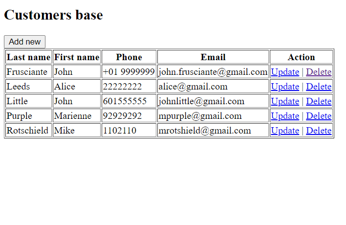
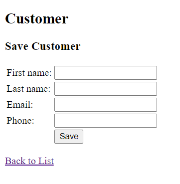

# customers-base
Simple application performing Create Read Update Delete operations on customers records.

## Technology

- Java 8
- Spring MVC
- JSP
- MySQL
- Maven
- Hibernate
- Cargo Plugin

## How to run

To run this app you need to have installed Maven and MySQL server.

- enter your db connection details in jdbc.properties file

`jdbc.username=your-name
jdbc.password=your-password`

- run sql scripts from sql directory

- to run with command line use:

`mvn clean install cargo:run`

## Endpoints

@GET/customers-base/customers/

@GET/customers-base/customers/new

@GET /customers-base/customers/{id}/edit

@POST /customers-base/customers/new

@POST /customers-base/customers/{id}/edit

@GET  /customers-base/customers/{id}/delete

## Screenshots

